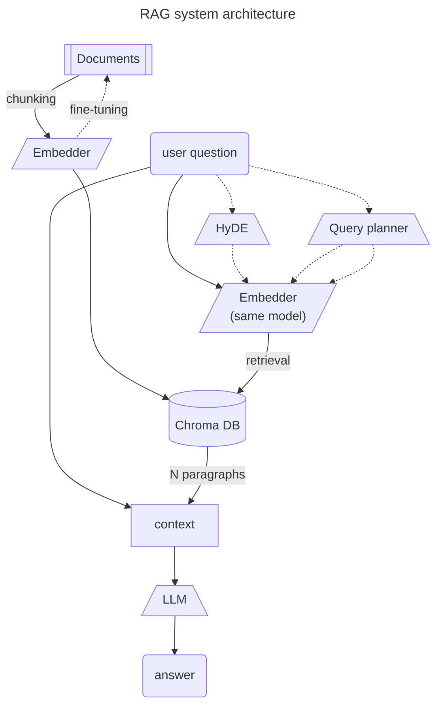

### Prototype of a RAG system built with langchain and Llama 3

Experiments to improve quality include:
* embedders fine-tuning
* HyDE [(Gao et al., 2023)](https://aclanthology.org/2023.acl-long.99)
* query planning

[Presentation of the project](https://docs.google.com/presentation/d/1z8g3vZrzmakzrFJbgXKsu8rgrkYW8GhguycNe4YIODg/edit?usp=sharing) (in Russian)

