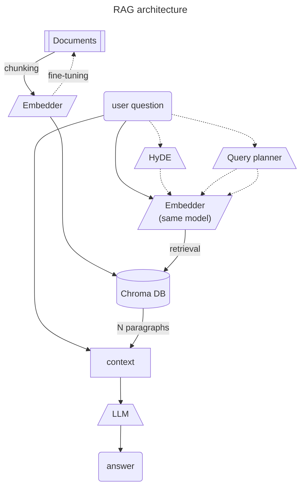

```mermaid
---
title: RAG architecture
---
flowchart TD
    docs[[Documents]]
    embedder_docs[/Embedder/]
    embedder[/"Embedder\n(same model)"/]
    chroma[(Chroma DB)]
    context
    
    query(user question)
    hyde[/HyDE\]
    planner[/Query planner\]
    
    llm[/LLM\]
    
    answer(answer)
    
    docs --chunking--> embedder_docs
    embedder_docs -.fine-tuning.-> docs
    embedder_docs --> chroma
    
    query --> embedder
    query --> context
    query -.-> hyde & planner
    hyde -.-> embedder
    planner -.-> embedder & embedder
    
    embedder --retrieval--> chroma
    chroma --N paragraphs--> context
    context --> llm
    llm --> answer
    
    docs ~~~ query
```